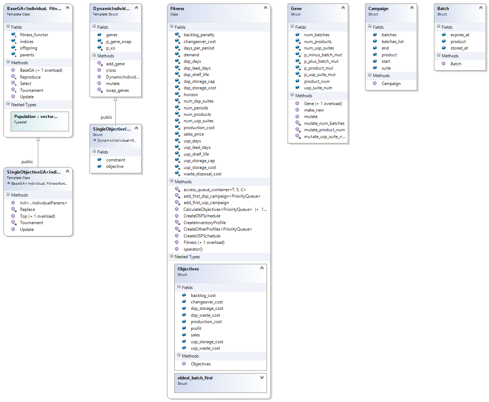

# Continuous-Time Capacity Planning 
Application used in the conference paper titled "Continuous-time heuristic models for medium-term capacity planning of multi-product biopharmaceutical manufacture" ([link](https://books.google.co.uk/books?id=3xtYDgAAQBAJ&lpg=PA1303&ots=nOhGWbjnCg&dq=Continuous-Time%20Heuristic%20Model%20for%20Medium-Term%20Capacity%20Planning%20of%20a%20Multi-Suite%2C%20Multi-Product%20Biopharmaceutical%20Facility&pg=PA1303#v=onepage&q&f=true)).

## Requirements 

*Tested on Windows*

- Python 3.5
- Cython 0.26
- Visual Studio 2015 (Visual Studio 2017 should be fine too)

## How to install

```
git clone https://github.com/karolisjan/Continuous-Time-Capacity-Planning.git
cd Continuous-Time-Capacity-Planning
pip install -r requirements.txt
python setup.py build_ext --inplace 
```

[Plotly](https://plot.ly/) account (free) might be needed to enable plotting (see this [link](https://plot.ly/python/getting-started/)).

## How to run

Run ```jupyter notebook``` and open ```demo.ipynb```.

## C++ code layout

